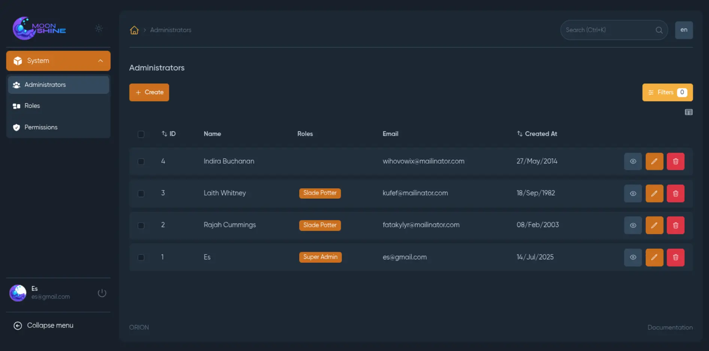
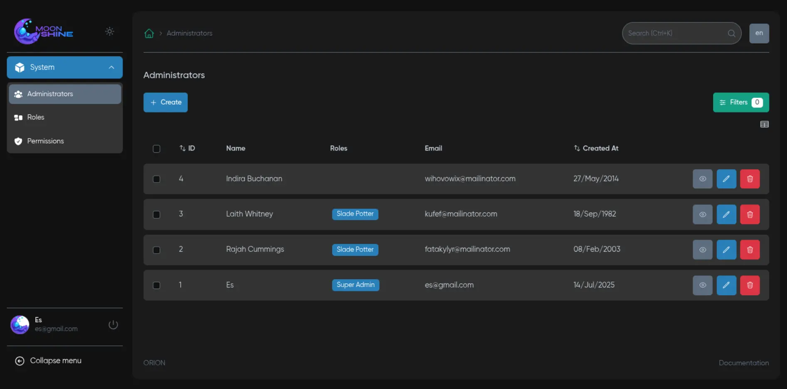
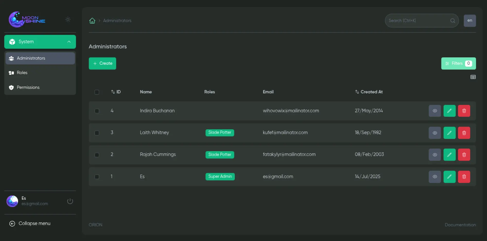
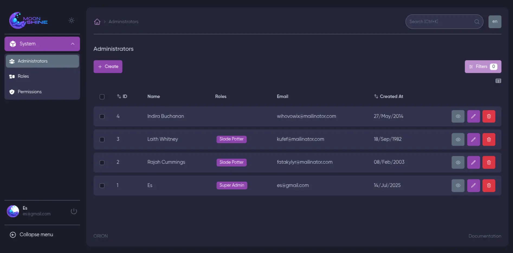

# Orion: Starter Kit for Laravel MoonShine 🚀

**Orion** is a modular starter project that speeds up the development of admin panels in Laravel using [MoonShine](https://moonshine-laravel.com/) as the admin framework.

## 📦 Main Technologies

| Package                     | Version | Description                  |
| --------------------------- | ------- | ---------------------------- |
| Laravel                     | v11     | Core PHP framework           |
| MoonShine                   | v3      | Admin panel                  |
| moonshine-roles-permissions | v3      | Roles and permissions system |
| internachi/modular          | v2      | Modular architecture         |

## ✨ Key Features

### 🛠 Base Configuration

-   Fully pre-configured MoonShine
-   Ready-to-use modular architecture

### 🔐 Security

-   Integrated RBAC (Roles and Permissions) system
-   Command for automatic permission generation

Permissions are automatically generated using the [`LaunchPermissions`](app-modules/moonlaunch/src/Console/Commands/LaunchPermissions.php) command. This command scans the **registered MoonShine resources** and creates the necessary permissions automatically.

### 🎨 Interface

-   4 pre-installed visual themes
-   Support for both English and Spanish

## 🖼 Theme Preview

| Theme 1                           | Theme 2                           | Theme 3                           | Theme 4                           |
| --------------------------------- | --------------------------------- | --------------------------------- | --------------------------------- |
|  |  |  |  |

Themes can be switched in the [`MoonlaunchServiceProvider`](app-modules/moonlaunch/src/Providers/MoonlaunchServiceProvider.php)


## 🚀 Installation

1. Clone the repository:

    ```bash
    git clone https://github.com/estivenm0/orion.git
    cd orion
    ```

2. Set up the environment:

    ```bash
    cp .env.example .env
    composer install
    ```

3. Run the installer:
    ```bash
    php artisan launch:install
    ```

The installer will automatically:

-   Generate the application key
-   Run database migrations
-   Create permissions and the superadmin role
-   Create the initial user

---

📘 **Additional Documentation**:

-   [moonshine](https://moonshine-laravel.com/docs)
-   [moonshine-roles-permissions](https://github.com/SWEET1S/moonshine-roles-permissions/)
-   [modular](https://github.com/InterNACHI/modular)
