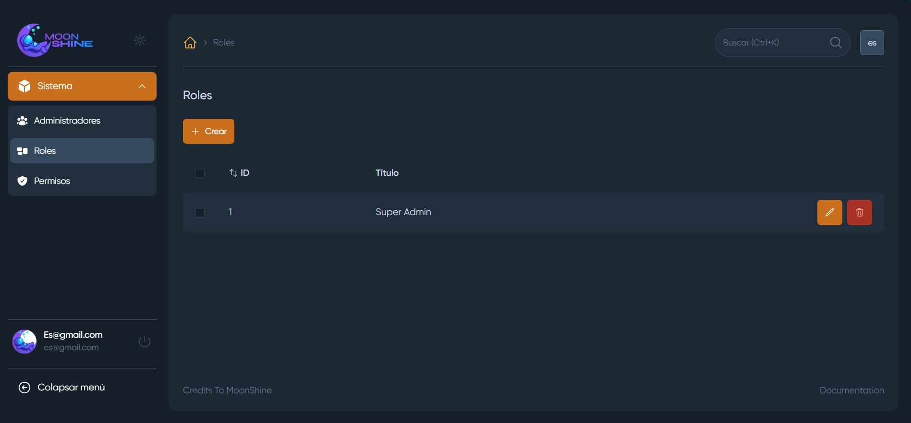
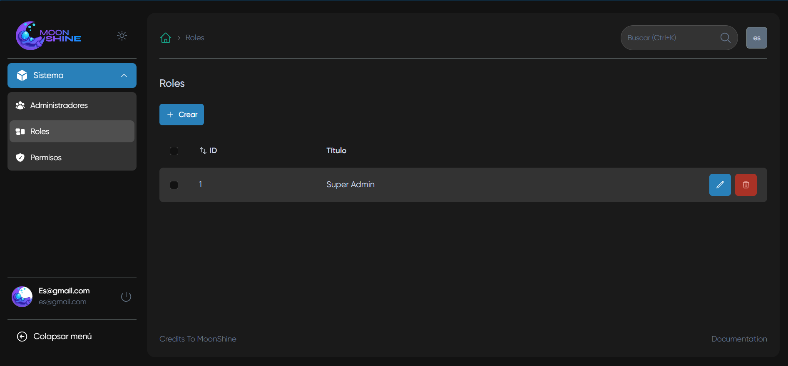

# Orion: Starter Kit para Laravel MoonShine 🚀

**Orion** es un proyecto inicial modular que acelera el desarrollo de paneles administrativos en Laravel utilizando [MoonShine](https://moonshine-laravel.com/) como framework administrativo.

## 📦 Tecnologías principales

| Paquete                     | Versión | Descripción                 |
| --------------------------- | ------- | --------------------------- |
| Laravel                     | v11     | Framework PHP base          |
| MoonShine                   | v3      | Panel administrativo        |
| moonshine-roles-permissions | v3      | Sistema de roles y permisos |
| internachi/modular          | v2      | Arquitectura modular        |

## ✨ Características destacadas

### 🛠 Configuración base

-   Preconfiguración completa de MoonShine
-   Arquitectura modular lista para usar

### 🔐 Seguridad

-   Sistema RBAC (Roles y Permisos) integrado
-   Comando para generación automática de permisos

el comando para la generación de permisos es: [LaunchPermissions](app-modules/moonlaunch/src/Console/Commands/LaunchPermissions.php) allí haces lo siguiente para crear los permisos de un recurso

```bash
   $this->call('moonshine-rbac:permissions', [
        'resourceName' => 'AdminResource'
     ]);
```

### 🎨 Interfaz

-   2 temas visuales preinstalados
-   Soporte para español e inglés

## 🖼 Vista previa de temas

| Tema Claro                    | Tema Oscuro                   |
| ----------------------------- | ----------------------------- |
|  |  |

los temas los cambias en MoonShineServiceProvider

```bash
  (new ThemeApplier($colorManager))->theme1();
  (new ThemeApplier($colorManager))->theme2();
```

## 🚀 Instalación

1. Clonar repositorio:

    ```bash
    git clone https://github.com/estivenm0/orion.git
    cd orion
    ```

2. Configurar entorno:

    ```bash
    cp .env.example .env
    composer install
    ```

3. Ejecutar instalador:
    ```bash
    php artisan launch:install
    ```

El instalador ejecuta automáticamente:

-   Generación de clave de aplicación
-   Migraciones de base de datos
-   Creación de permisos y rol superadmin
-   Creación de usuario inicial

---

📘 **Documentación adicional**:

-   [moonshine](https://moonshine-laravel.com/docs)
-   [moonshine-roles-permissions](https://github.com/SWEET1S/moonshine-roles-permissions/)
-   [modular](https://github.com/InterNACHI/modular)
